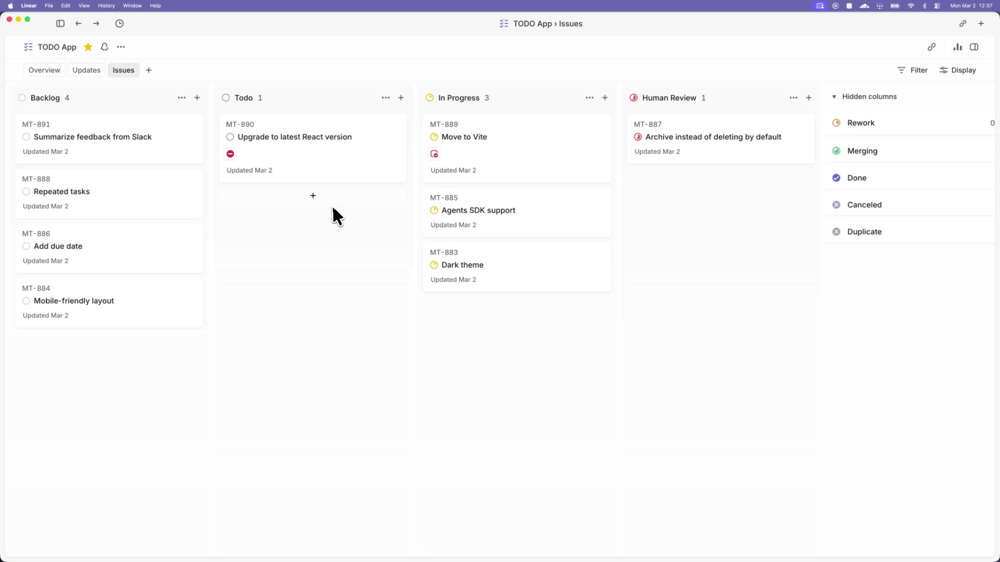

# Odyssey

Odyssey turns project work into isolated, autonomous implementation runs, allowing teams to manage
work instead of supervising coding agents.

_In this [demo video](.github/media/odyssey-demo.mp4), Odyssey monitors a Linear board for work and spawns agents to handle the tasks. The agents complete the tasks and provide proof of work: CI status, PR review feedback, complexity analysis, and walkthrough videos. When accepted, the agents land the PR safely. Engineers do not need to supervise Codex; they can manage the work at a higher level._

> [!WARNING]
> Odyssey is a low-key engineering preview for testing in trusted environments.

## Running Odyssey

### Requirements

Odyssey works best in codebases that have adopted
[harness engineering](https://openai.com/index/harness-engineering/). Odyssey is the next step --
moving from managing coding agents to managing work that needs to get done.

### Option 1. Make your own

Tell your favorite coding agent to build Odyssey in a programming language of your choice:

> Implement Odyssey according to the following spec:
> https://github.com/openai/odyssey/blob/main/SPEC.md

### Option 2. Use our experimental reference implementation

Check out [elixir/README.md](elixir/README.md) for instructions on how to set up your environment
and run the Elixir-based Odyssey implementation. You can also ask your favorite coding agent to
help with the setup:

> Set up Odyssey for my repository based on
> https://github.com/openai/odyssey/blob/main/elixir/README.md

---

## License

This project is licensed under the [Apache License 2.0](LICENSE).
